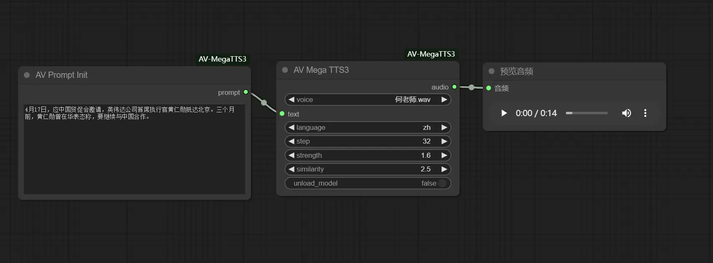

[中文](README-CN.md) | [English](README.md) 

# ComfyUI 的 MegaTTS3 声音克隆节点

高保真的语音克隆节点, 支持中英文, 并可跨语言克隆.



## 更新

- [2025-04-17]⚒️: 发布 v1.0.1
- [2025-04-16]⚒️: 发布 v1.0.0

## 安装

```
cd ComfyUI/custom_nodes
git clone https://github.com/avenstack/ComfyUI-AV-MegaTTS3.git
cd ComfyUI-AV-MegaTTS3
pip install -r requirements.txt
```

## 模型下载

1. [模型MegaTTS3国外](https://huggingface.co/ByteDance/MegaTTS3/tree/main)
2. [模型MegaTTS3国内](https://www.modelscope.cn/models/ByteDance/MegaTTS3/files)
3. [音色（用户上传）](https://drive.google.com/drive/folders/1QhcHWcy20JfqWjgqZX1YM3I6i9u4oNlr?usp=sharing)

模型存放目录：models/TTS/MegaTTS3
```
├─models
│  ─TTS
│  │  ├─MegaTTS3
│  │  │  ├─aligner_lm
│  │  │  ├─diffusion_transformer
│  │  │  ├─duration_lm
│  │  │  ├─g2p
│  │  │  ├─Voices # 音色存放目录 wav,npy
│  │  │  |  └─1.wav
|  │  |  |  └─1.npy
│  │  │  └─wavvae
│  │  ├──config.json
|  |  └──config.json
```


## 鸣谢

- [MegaTTS3](https://github.com/bytedance/MegaTTS3)
- [ComfyUI](https://github.com/comfyanonymous/ComfyUI)
- [ComfyUI-AV-MegaTTS3](github.com/avenstack/ComfyUI-AV-MegaTTS3)
- [ComfyUI_MegaTTS3](https://github.com/billwuhao/ComfyUI_MegaTTS3)
- [ComfyUI-MegaTTS](https://github.com/1038lab/ComfyUI-MegaTTS)